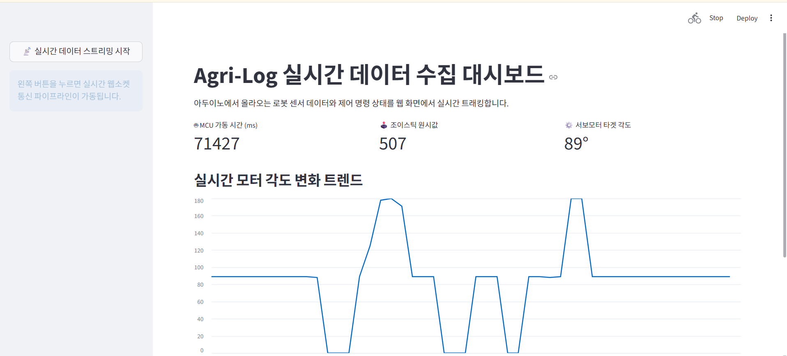

# Arduino UNO Joystick Control

이 프로젝트는 아두이노 UNO와 조이스틱을 이용해 로봇 관절을 실시간으로 제어하고 모니터링하는 시스템입니다.

주요 구성 요소:

- `serial_to_db.py`: 아두이노가 전송하는 시리얼 데이터를 SQLite 데이터베이스(`robot_axis_data.db`)에 저장합니다.
- `server.py`: FastAPI 기반 서버로, 시리얼 데이터를 읽어 웹소켓 클라이언트에 실시간으로 전송하고, 아두이노로 서보 각도 명령을 다시 전송합니다.
- `app.py`: Streamlit 대시보드로, 웹소켓을 통해 들어오는 실시간 데이터(조이스틱 값, MCU 타임스탬프, 서보 각도)를 시각화합니다.

이 파일 아래에서 프로젝트 동작 화면을 바로 확인할 수 있습니다.

