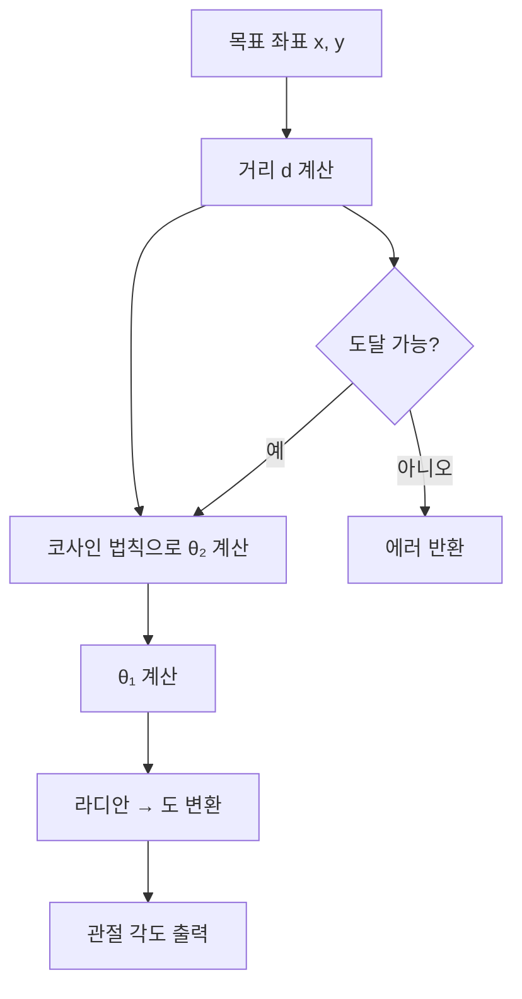
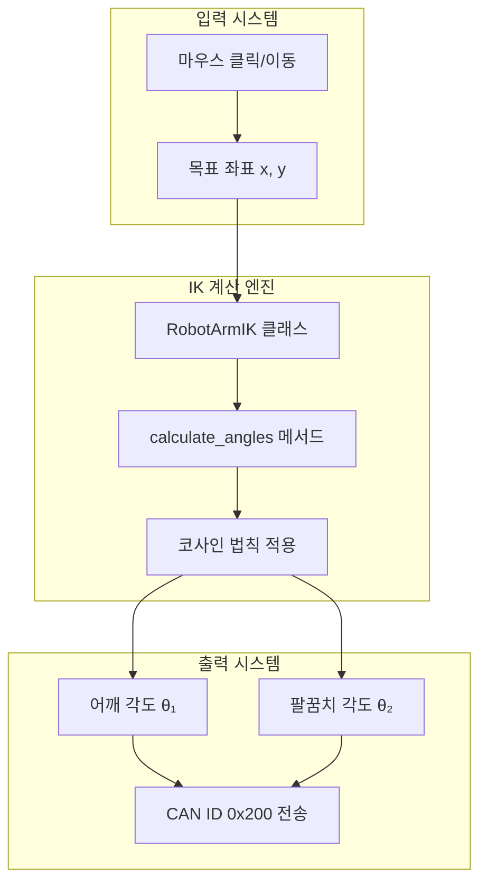
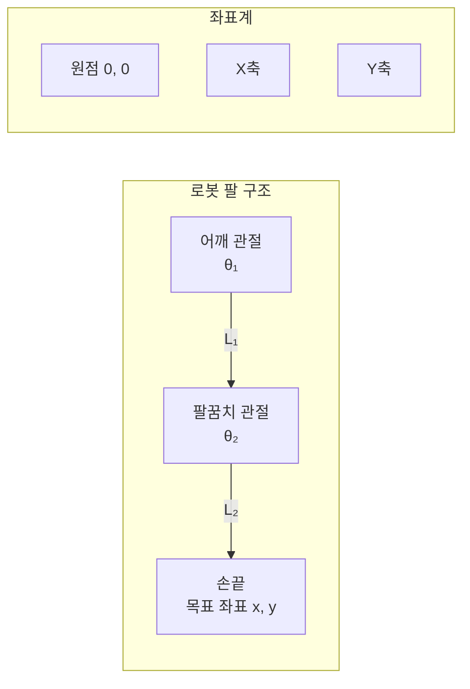
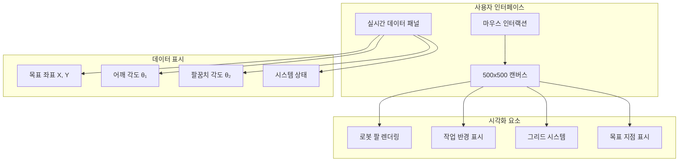

# PR6: 로봇 팔 역운동학(IK) 시뮬레이터

2관절 로봇 팔의 역운동학(Inverse Kinematics)을 구현한 교육용 프로젝트입니다. 목표 좌표를 입력하면 각 관절의 각도를 계산하여 로봇이 정확한 위치로 이동할 수 있도록 합니다.

## 역운동학(IK)이란?

역운동학은 로봇의 손끝이 도달해야 할 **목표 좌표(x, y)**를 입력받아, 각 **관절의 각도(θ₁, θ₂)**를 계산하는 기술입니다.

### 수학적 원리



### 핵심 공식

1. **거리 계산**: `d = √(x² + y²)`

2. **코사인 법칙 (팔꿈치 각도)**:
   ```
   cos(θ₂) = (d² - L₁² - L₂²) / (2 × L₁ × L₂)
   ```

3. **어깨 각도**:
   ```
   θ₁ = atan2(y, x) - atan2(L₂ × sin(θ₂), L₁ + L₂ × cos(θ₂))
   ```

## 시스템 구조



## 로봇 팔 기구학



## 파일 구조

```
pr6_Inverse_Kinematics_IK/
├── IK.py                    # IK 계산 파이썬 라이브러리
├── IK_visualization.html    # 인터랙티브 웹 시뮬레이터
└── README.md               # 프로젝트 문서
```

## 실행 방법

### 1. 파이썬 시뮬레이션
```bash
cd pr6_Inverse_Kinematics_IK
python IK.py
```

### 2. 웹 시각화
```bash
# 브라우저에서 HTML 파일 열기
open IK_visualization.html
```

## 코드 구현

### IK 계산 클래스
```python
class RobotArmIK:
    def __init__(self, l1, l2):
        self.l1 = l1  # 첫 번째 팔 길이
        self.l2 = l2  # 두 번째 팔 길이
    
    def calculate_angles(self, x, y):
        # 1. 거리 계산
        d_sq = x**2 + y**2
        d = math.sqrt(d_sq)
        
        # 2. 코사인 법칙으로 θ₂ 계산
        cos_theta2 = (d_sq - self.l1**2 - self.l2**2) / (2 * self.l1 * self.l2)
        
        # 3. 도달 가능성 확인
        if not (-1 <= cos_theta2 <= 1):
            return None, "거리가 너무 멉니다."
        
        # 4. 각도 계산 및 변환
        theta2 = math.acos(cos_theta2)
        theta1 = math.atan2(y, x) - math.atan2(self.l2 * math.sin(theta2), 
                                              self.l1 + self.l2 * math.cos(theta2))
        
        return (math.degrees(theta1), math.degrees(theta2)), "계산 성공"
```

### 웹 시각화 기능
- **실시간 마우스 추적**: 마우스 움직임에 따른 IK 계산
- **시각적 피드백**: 도달 가능/불가 영역 표시
- **관절 각도 표시**: 실시간 각도 값 출력
- **그리드 시스템**: 좌표 이해를 돕는 그리드

## 실행 결과 예시

### 성공 케이스
```
목표 좌표: (120, 50)
관절1(어깨): 22.5°
관절2(팔꿈치): 45.8°
이 각도값을 CAN ID 0x200에 실어 보내면 로봇이 움직입니다!
```

### 실패 케이스
```
경고: 거리가 너무 멉니다.
```

## 웹 인터페이스 기능



## IK 알고리즘 흐름

```mermaid
flowchart TD
    Start([시작]) --> Input[목표 좌표 x, y 입력]
    Input --> CalcDist[거리 d = √(x² + y²) 계산]
    CalcDist --> CheckReach{d ≤ L₁ + L₂?}
    
    CheckReach -->|아니오| Error[도달 불가 에러]
    Error --> End([종료])
    
    CheckReach -->|예| CalcCos[cos(θ₂) 계산]
    CalcCos --> CheckCos{-1 ≤ cos(θ₂) ≤ 1?}
    
    CheckCos -->|아니오| Error
    CheckCos -->|예| CalcTheta2[θ₂ = arccos(cos(θ₂))]
    CalcTheta2 --> CalcTheta1[θ₁ = atan2(y, x) - atan2(L₂sin(θ₂), L₁ + L₂cos(θ₂))]
    CalcTheta1 --> Convert[라디안 → 도 변환]
    Convert --> Success[각도 값 반환]
    Success --> End
```

## 기술 특징

### 1. 수학적 정확성
- **코사인 법칙**: 정확한 각도 계산
- **삼각함수**: 좌표계 변환
- **오류 처리**: 도달 불가 영역 감지

### 2. 실시간 시각화
- **Canvas API**: 고성능 그래픽 렌더링
- **마우스 이벤트**: 실시간 인터랙션
- **애니메이션**: 부드러운 로봇 팔 움직임

### 3. 교육적 가치
- **시각적 학습**: IK 원리 직관적 이해
- **실습 기반**: 직접 조작 가능한 시뮬레이터
- **실제 적용**: CAN 통신과 연계

## CAN 통신 연계

계산된 각도 값은 실제 로봇 제어를 위해 CAN 버스를 통해 전송됩니다:

```
CAN ID 0x200: [θ₁, θ₂] → 로봇 팔 관절 제어
```

## 확장 가능성

- **3D IK**: Z축 추가 및 3차원 공간 확장
- **다관절 로봇**: 3개 이상 관절 지원
- **경로 계획**: 여러 목표점을 연결하는 경로 생성
- **충돌 회피**: 장애물 감지 및 회피 알고리즘

## 학습 포인트

1. **기구학 이해**: 정운동학 vs 역운동학
2. **삼각함수 응용**: 실제 로봇 제어에서의 수학적 활용
3. **좌표계 변환**: 화면 좌표와 로봇 좌표 간 변환
4. **실시간 계산**: 인터랙티브 시스템의 수학적 처리

## 트러블슈팅

1. **도달 불가 에러**: 목표 좌표가 로봇 팔 길이 합보다 먼 경우
2. **특이점**: 팔이 완전히 뻗었거나 접힌 상태에서의 수치 불안정
3. **좌표계**: 화면 좌표와 수학 좌표의 차이 주의
4. **단위 변환**: 라디안과 도(degree) 간 변환 오류
