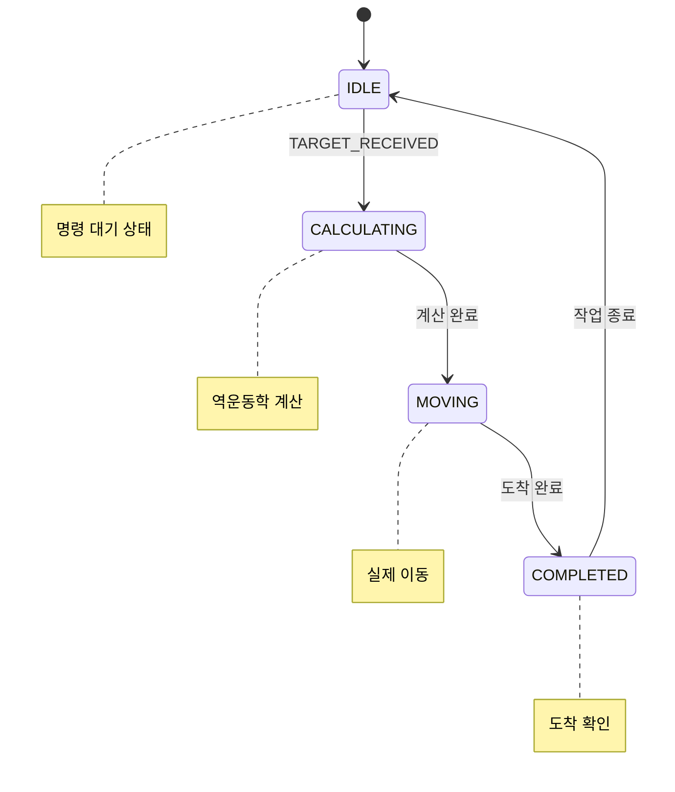
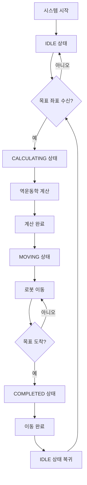
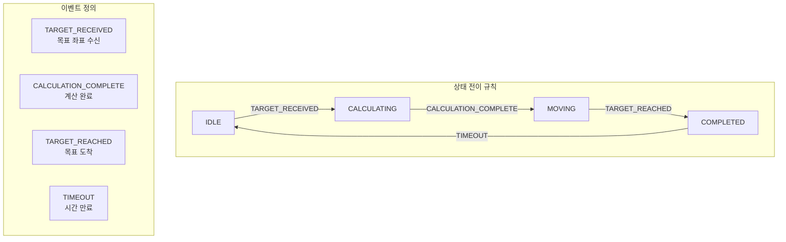
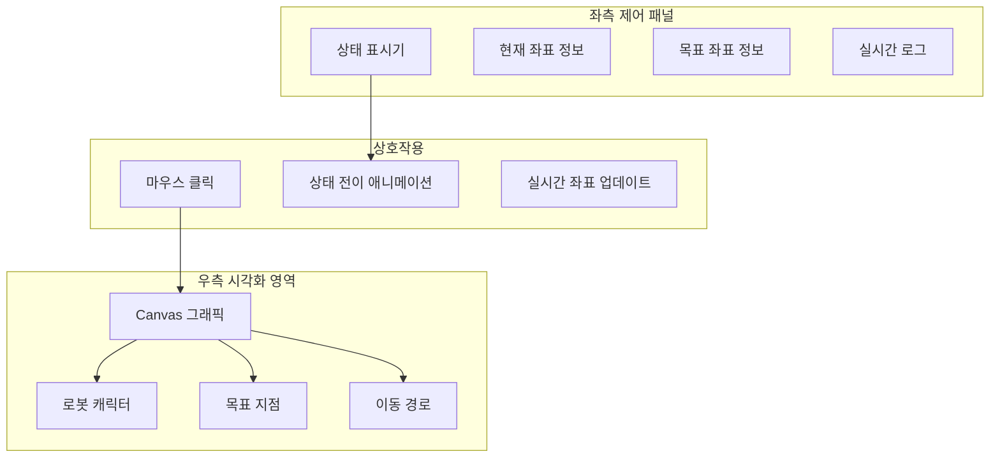
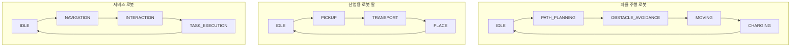

# PR7: 유한 상태 머신(FSM) 로봇 제어 시스템

유한 상태 머신(Finite State Machine)을 구현한 로봇 제어 시스템입니다. 로봇의 동작을 명확한 상태들로 정의하고, 상태 전이를 통해 체계적인 제어 로직을 구현합니다.

## 유한 상태 머신(FSM)이란?

유한 상태 머신은 **제한된 개수의 상태**를 가지며, **특정 이벤트**에 따라 상태가 전이되는 수학적 모델입니다. 로봇 제어에서 복잡한 동작을 체계적으로 관리할 수 있습니다.

### FSM의 기본 요소

- **상태(State)**: 로봇이 현재 어떤 동작을 수행 중인지
- **이벤트(Event)**: 상태 변화를 유발하는 외부 입력
- **전이(Transition)**: 한 상태에서 다른 상태로의 변경
- **초기 상태**: 시스템 시작 시의 기본 상태

## 로봇 FSM 상태 구조



## 상태 전이 흐름



## 파일 구조

```
pr7_fsm_Finite_state_machine/
├── fsm.py                    # FSM 로직 파이썬 구현
├── fsm_visulization.html     # 인터랙티브 웹 시뮬레이터
└── README.md                 # 프로젝트 문서
```

## 상세 상태 정의

### 1. IDLE (대기 상태)
- **설명**: 시스템이 새로운 명령을 기다리는 상태
- **동작**: 마우스 클릭 또는 외부 입력 대기
- **전이 조건**: `TARGET_RECEIVED` 이벤트 발생 시

### 2. CALCULATING (계산 상태)
- **설명**: 목표 좌표로의 이동을 위한 계산 수행
- **동작**: 역운동학 계산, 경로 계획
- **전이 조건**: 계산 완료 시 자동 전이

### 3. MOVING (이동 상태)
- **설명**: 실제 로봇이 목표 지점으로 이동 중
- **동작**: 모터 제어, 위치 피드백 확인
- **전이 조건**: 목표 지점 도착 시

### 4. COMPLETED (완료 상태)
- **설명**: 작업이 성공적으로 완료된 상태
- **동작**: 결과 확인, 로그 기록
- **전이 조건**: 일정 시간 후 IDLE로 복귀

## 코드 구현

### FSM 클래스 구조
```python
class RobotFSM:
    def __init__(self):
        self.state = "IDLE"  # 초기 상태
        
    def update(self, event=None):
        """상태 전이 로직 처리"""
        if self.state == "IDLE":
            if event == "TARGET_RECEIVED":
                self.state = "CALCULATING"
                # 계산 로직 수행
                
        elif self.state == "CALCULATING":
            # 계산 완료 후 이동 상태로
            self.state = "MOVING"
            
        # ... 다른 상태들 처리
```

### 상태 전이 테이블


## 웹 시각화 기능

### 인터페이스 구성


### 시각화 특징
- **실시간 상태 표시**: 현재 FSM 상태를 시각적으로 강조
- **로봇 이동 애니메이션**: 부드러운 이동 효과
- **경로 추적**: 지나온 경로를 점선으로 표시
- **로그 시스템**: 상태 변화 기록

## 실행 방법

### 1. 파이썬 시뮬레이션
```bash
cd pr7_fsm_Finite_state_machine
python fsm.py
```

### 2. 웹 시각화
```bash
# 브라우저에서 HTML 파일 열기
open fsm_visulization.html
```

## 실행 결과 예시

### 파이썬 콘솔 출력
```
시스템 시작 : 현재상태는 [IDLE]

--- 작업 시작: 마우스 클릭됨 ---

[IDLE -> CALCULATING] 좌표를 받았음. 역운동학 계산을 시작합니다.
[CALCULATING -> MOVING] 계산 완료. CAN ID 0x200 으로 각도 데이터를 전송합니다.
[MOVING -> COMPLETED] 로봇 팔이 목표 지점에 도착했습니다.
[COMPLETED -> IDLE] 작업을 마치고 다음 명령을 위해 대기 상태로 복귀합니다.
```

### 웹 인터페이스 동작
1. **클릭**: 캔버스 영역 클릭으로 목표 지점 설정
2. **상태 변화**: IDLE → CALCULATING → MOVING → COMPLETED 순서로 전이
3. **로봇 이동**: 녹색 원이 목표 지점까지 부드럽게 이동
4. **경로 표시**: 이동 경로가 흰색 점으로 표시됨

## FSM의 장점

### 1. 명확성
- **상태 정의**: 각 상태의 역할이 명확히 구분됨
- **전이 규칙**: 상태 변경 조건이 명확하게 정의됨
- **디버깅 용이**: 문제 발생 시 특정 상태에서 원인 파악

### 2. 확장성
- **새 상태 추가**: 쉽게 새로운 상태를 추가 가능
- **전이 로직 수정**: 기존 상태 전이 규칙 변경 용이
- **모듈화**: 각 상태의 동작을 독립적으로 관리

### 3. 안정성
- **예측 가능**: 시스템 동작이 예측 가능해짐
- **오류 방지**: 허용되지 않은 상태 전이 방지
- **일관성**: 항상 정의된 순서대로 동작

## 실제 적용 시나리오



## 기술적 구현

### 1. 상태 관리
```python
class StateManager:
    def __init__(self):
        self.current_state = "IDLE"
        self.state_history = []
        
    def transition_to(self, new_state, event):
        old_state = self.current_state
        if self.is_valid_transition(old_state, new_state):
            self.current_state = new_state
            self.log_transition(old_state, new_state, event)
```

### 2. 이벤트 처리
```python
class EventHandler:
    def __init__(self, fsm):
        self.fsm = fsm
        self.event_queue = []
        
    def add_event(self, event_type, data):
        self.event_queue.append((event_type, data))
        
    def process_events(self):
        while self.event_queue:
            event, data = self.event_queue.pop(0)
            self.fsm.update(event)
```

### 3. 애니메이션 시스템
```javascript
class AnimationSystem {
    async animateStateTransition(fromState, toState) {
        // 상태 전이 시각적 효과
        await this.fadeOut(fromState);
        await this.highlight(toState);
        await this.playTransitionSound();
    }
}
```

## 확장 가능성

### 1. 다중 로봇 제어
- **FSM 네트워크**: 여러 로봇의 FSM 연동
- **동기화**: 로봇 간 상태 동기화
- **협업 작업**: 여러 로봇의 협력 FSM

### 2. 고급 상태
- **ERROR 상태**: 오류 처리 및 복구
- **MAINTENANCE 상태**: 유지보수 모드
- **EMERGENCY 상태**: 긴급 정지

### 3. 학습 기능
- **상태 전이 최적화**: 경험 기반 전이 규칙 개선
- **적응형 FSM**: 환경에 따른 상태 변화
- **머신러닝 통합**: RL을 통한 상태 전이 학습

## 학습 포인트

1. **상태 머신 설계**: 명확한 상태 정의와 전이 규칙
2. **이벤트 기반 프로그래밍**: 비동기적 상태 처리
3. **시스템 아키텍처**: 모듈화된 상태 관리
4. **사용자 인터페이스**: 상태 시각화 및 상호작용

## 트러블슈팅

1. **상태 갇힘**: 특정 상태에서 벗어나지 못하는 문제
2. **전이 오류**: 허용되지 않은 상태 전이 발생
3. **이벤트 유실**: 이벤트 큐에서 이벤트 손실
4. **동기화 문제**: 다중 스레드 환경에서의 상태 일관성

## 관련 프로젝트 연계

- **PR5**: CAN 통신으로 상태 정보 전송
- **PR6**: IK 계산 결과를 MOVING 상태에서 활용
- **PR8**: 센서 데이터를 이벤트로 처리
